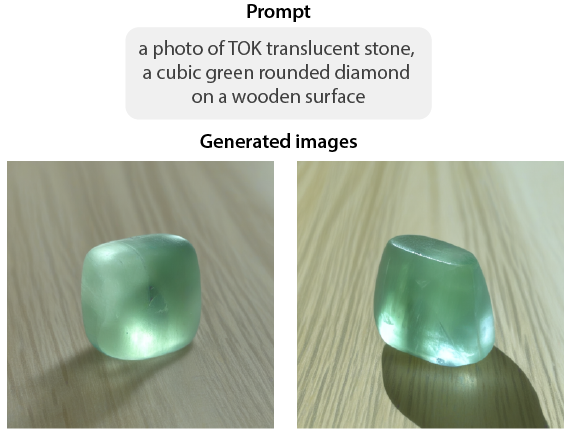

<!-- Improved compatibility of back to top link: See: https://github.com/othneildrew/Best-README-Template/pull/73 -->

<!-- PROJECT LOGO -->
 

<h3 align="left">Material Generation with Stable Diffusion XL</h3>

  

    Chenxi Liao
  

Here is a demo of training a Stable Diffusion XL to generate realistic material appearances, by learning from a small set of real photos of rocks/crystals. 

(<a href="#readme-top">back to top</a>)

<!-- GETTING STARTED -->
## Prepare the image dataset
* Create a folder that contains a specific material. See example for the dataset structure in [rocks](rocks).

* In the image dataset, create the [metadata.jsonl](rocks/metadata.jsonl).
  - file_name: the file name of the training image
  - prompt: the caption of the image 
  
## Training the model
* The [notebook](SDXL_DreamBooth_LoRA_material_generation.ipynb) demonstrates the training pipeline. 

* Device: use a A100 GPU on Google Colab. 

* Upon training, you can generate [images from word prompt](info_imgs/teaser_sdxl.png).

(<a href="#readme-top">back to top</a>)

